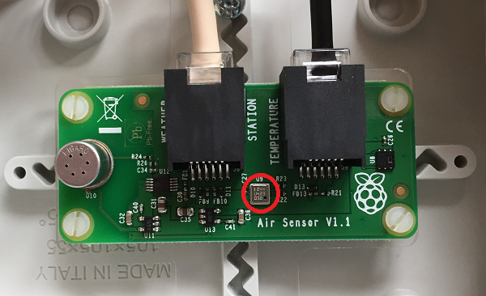

# About the barometric pressure sensor

Here is the barometric pressure sensor supplied with the Raspberry Pi Weather Station kit as part of the air quality sensor board:

The component is a BMP180 digital barometric pressure sensor.

## How does it work?

Barometric pressure is the pressure exerted by the weight of air. You might think that air doesn't weigh anything, but if you were to take a 1cm2 cross section of air measured from sea level to the top level of the atmosphere, it would have a mass of approximately 1.03kg and weigh about 10.1 newtons. This air exerts a pressure of 101,000N/m2.

Weight * Number of cm2 in 1m2 = Pressure in N/m2

10.1N * 1000 = 101,000N/m2

Our barometric pressure sensor measures pressure in pascals (Pa). One pascal is equal to one newton per square metre.

1Pa = 1N/m2

Here is the [data sheet](https://www.rapidonline.com/pdf/35-1630_V1.pdf) for the BMP180 digital barometric pressure sensor.

## How does the sensor connect?

1. First, set up your main Raspberry Pi Weather Station box.
1. The barometric pressure sensor is a component on the air quality sensor board. Connect this board to the main Weather Station with the cable to the port labelled "Air Sensor".
1. Power on your Weather Station and log in.

